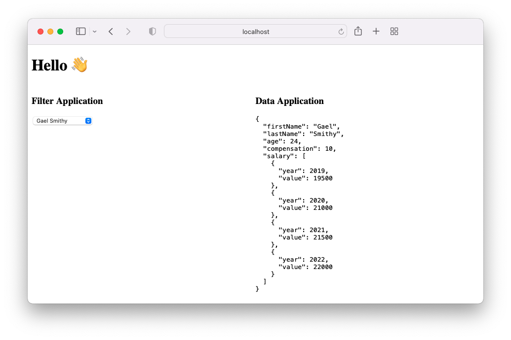

# :zap: Nx micro-frontend example with react and express

Nx monorepo with react based micro-frontend applications with express API

## :page_facing_up: Table of contents

* [:zap: Nx micro-frontend example with react and express](#zap-nx-micro-frontend-example-with-react-and-express)
  * [:page_facing_up: Table of contents](#page_facing_up-table-of-contents)
  * [:books: List of services](#books-list-of-services)
  * [:camera: Screenshots](#camera-screenshots)
  * [:signal_strength: Technologies](#signal_strength-technologies)
  * [:floppy_disk: Setup](#floppy_disk-setup)
  * [:cool: Features](#cool-features)
  * [:clipboard: Status & To-do list](#clipboard-status)
  * [:clap: Inspiration](#clap-inspiration)
  * [:file_folder: License](#file_folder-license)
  * [:envelope: Contact](#envelope-contact)

## :books: List of services

* API Data: The backend service stores some data, and can return them on request.
* API Filter: The backend of this service can provide filters for the data API
* Frontend Data: The front-end of this service is responsible for displaying all information regarding the data. Selection criteria will be communicated from another service.
* Frontend Filter: Provides a select to load and present the data
* Shell: This is the host service which contains the Data and Filter frontends

## :camera: Screenshots

## :signal_strength: Technologies

* [Nx](https://nx.dev) Build framework used to create project workspace
* [React](https://reactjs.org/)  A JavaScript library for building user interfaces
* [Express](https://expressjs.com/) Express is a minimal and flexible Node.js web application framework
* [Nanostores](https://github.com/nanostores/nanostores) State manager for React/RN/Preact/Vue/Svelte with many atomic tree-shakable stores
* [Cypress](https://www.cypress.io/) E2E testing framework

## :floppy_disk: Setup

* `npm i` to install dependencies
* `npm start` start frontend dev server on `http://localhost:4200/`
* `npm test` run unit tests

## :wrench: Testing
* `npm test` run jest unit tests
* `npm run e2e` run cypress e2e tests

## :cool: Features

* Monorepo shared libraries etc. makes for tidier code
* Cypress stores test screenshot in `dist\cypress\apps\shell-e2e\screenshots\app.spec.ts\shell-data`

## :clipboard: Status

* Status: Working.
* To-Do: test Tailwind CSS purge for build, change datafile,

## :clap: Inspiration

* [Dreevo: Angular Production - Build, Test & Deploy a Full Stack Application using Nx - Part I](https://www.youtube.com/watch?v=j38ufd8Q86w&t=119s)
* [Dynamic micro frontends with Nx and React](https://medium.com/@wangel13/dynamic-micro-frontends-with-nx-and-react-d04a350732a4)
* [Nx Faster Builds with Module Federation](https://nx.dev/recipes/module-federation/faster-builds)

## :file_folder: License

* THE BEER-WARE LICENSE

## :envelope: Contact

* Repo created by [Tamás Csaba](https://github.com/tamascsaba)
